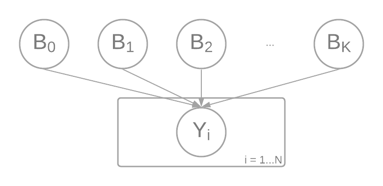
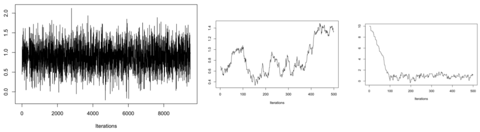

Note: This notebook captures some of _my_ understanding of the subject, particularly from a practical stand-point of _using_ the methods in our HRI studies. There are much better resources for actually conducting Bayesian Analysis that are out there, and I will link to those both in the text and at the end. I have also found that Stack Overflow is a wonderfull resource. If you think I have misunderstood or misrepresented any of the following points, please do point those out so that I can improve on this document.

```{r, message=FALSE, warning=FALSE}
library(boot)
library(car)
library(lsmeans)
library(grid)
library(gridExtra)
library(ggplot2)
library(tidyverse)
library(broom)
library(ggsignif)
library(corrplot)
library(dotwhisker)
library(rjags)
library(brms)
library(bayesplot)
library(bayestestR)
library(sjstats)
library(parameters)
library(see)

# Setup for multiprocessing
# options(mc.cores = 4)
```


## Load a dataset

We'll use the `warpbreaks` dataset that comes with R

```{r}
data("warpbreaks")
head(warpbreaks)
```

The goal of this dataset is to predict the number of breaks in a yarn of wool given the type of wool (A or B), and the tension in the loom (L, M, H). This is a Two-Way ANOVA.

```{r}
table(warpbreaks$wool, warpbreaks$tension)
```

Visualize the data in a boxplot

```{r}
warpbreaks %>%
  ggplot(aes(log(breaks), x = wool, fill = tension)) +
  geom_boxplot()
```


## Hypothesis Testing

First, let's perform the simple hypothesis tests that are the bread and butter of most of our studies. We look at each of the factors that affect breaks independently, starting with the wool factor. (<small>Note: I conducted Bartlett and Shapiro tests to check for homoskedasticity and normality of the data respectively. Not shown here in the interest of space.</small>)

```{r}
print(t.test(log(breaks) ~ wool, data = warpbreaks))
```

So according to the tests, there is no significant effect of the wool types... Should we believe this? What does this entail?

Then, let's run an omnibus test, ANOVA, on the tension parameter. To do this, we set up a linear model (more on this later) and then evaluate the variances within and between groups. (We do a type-II ANOVA here, recommended. There are other types called I or III depending on the types of effects that you might be interested in.)

```{r}
model1 = lm(log(breaks) ~ 1 + tension, data = warpbreaks)
print(Anova(model1))
```

This ANOVA output should be familiar to those of us that have performed an ANOVA. It shows that overall, a large portion of the breaks are explained by the tension variable. Let's assume that we're interested in all possible pairwise comparisons of the tension variables, then using Tukey's HSD:

```{r}
print(lsmeans(model1, pairwise ~ tension, adjust = "tukey"))
```

So there is a significant difference between L and H, and no significant difference otherwise. What does this mean?

Let's plot the results we have so far based on the hypothesis tests:

```{r}
p1 = warpbreaks %>%
  ggplot(aes(y = log(breaks), x = wool, fill = wool)) +
  geom_boxplot()

p2 = warpbreaks %>%
  ggplot(aes(y = log(breaks), x = tension, fill = tension)) +
  geom_boxplot() +
  geom_signif(y_position = 4.35, xmin = 1, xmax = 3, annotation = "**")

grid.arrange(p1, p2, ncol = 2)
```


## Model Comparisons

In order to perform ANOVA, we had to set up a linear model; what's going on here? As shown in this wonderful [link](https://lindeloev.github.io/tests-as-linear/), all hypothesis tests are essentially **model comparisons** of linear models. Essentially, the tests above are a result of tests on the linear regression coefficients given the data.

There is much more theory to this, but at a high level, all hypothesis testing schemes assume a model of the following form (for each data point $i \in \{1 ... N\}$):

$$\begin{aligned}
y_i &= \beta_0 + \beta_1 x_{i,1} + \beta_2 x_{i,2} + \ldots + \beta_K x_{i,K} + \epsilon_i\\
\epsilon_i &\sim \mathcal{N}(0, \sigma^2) [i.i.d.]
\end{aligned}$$

Assuming $K$ independent variables and $N$ data points. Broadly speaking, the inferences that we draw are based on $\mathop{\mathbb{E}}[y | X], var[y|X]$, the adherence of $\epsilon_i$ to the normally distributed assumption, etc. To that last point, for instance, in a repeated measures ANOVA, we can decompose $\epsilon_i$ to a component that is indepependent of all data points, and another component that depends on the ID of the subject under consideration.

So in our case of the ANOVA from earlier, assume a linear model like the one below for the **expectation** of the dependent variable (breaks) for the ith data point:

$$\mathop{\mathbb{E}}[log(breaks_i)] = \beta_0 + \beta_1 tension_{i==M} + \beta_2 tension_{i==H}$$
Then the act of running ANOVA is simply fitting the above model to derive values for $\beta_0, \beta_1, \beta_2$, and then making inferences on the importance of the tension variable's levels based on the confidence interval of those coefficients. As an example:

1. Assume that data point $i$ has a $tension$ of $L$. Then, by the equation, we **expect** the value of $log(breaks_i) = \beta_0$.
1. Similarly, assume that data point $i$ has a tension of $M$. Then, by the equation, we **expect** the value of $log(breaks_i) = \beta_0 + \beta_1$.

And continuing that logic, once we derive the confidence intervals of the variables $\beta_1$ and $\beta_2$, we can comment on the significance of the difference in breaks between levels M and H to the level L (we can also get the third, difference because it is a difference of the first two; with some additional computation to account for the variance in the coefficient estimates).

Looking directly at the coefficient tables for the ANOVA linear model:

```{r}
print(summary(model1))
```

What we're doing every time that we conduct a hypothesis test is that we're coming up with an equation for how the factors affect the expected value of our dependent variable. Mathematically, the problem above has actually been set up so that:

$$\begin{aligned}
\mathop{\mathbb{E}}[log(breaks_{tension_{i==L}})] &= \beta_0 \\
\mathop{\mathbb{E}}[log(breaks_{tension_{i==M}})] &= \beta_0 + \beta_1 \\
\mathop{\mathbb{E}}[log(breaks_{tension_{i==H}})] &= \beta_0 + \beta_2
\end{aligned}$$

Aside: this is one of [many](https://marissabarlaz.github.io/portfolio/contrastcoding/) [coding](https://phillipalday.com/stats/coding.html) [schemes](https://stats.stackexchange.com/questions/78354/what-is-a-contrast-matrix) that we could've used for the variables. The above is the default in R and the most frequently used: it is called Dummy coding where you use dummy variables to compare all levels of a factor to a reference level, "L" in our case. You might need to use Sum, Contrast, or even Helmert coding depending on the semantic meaning of the factor levels that you are comparing. This is especially important in Two-Way ANOVA, [sneak](https://web.archive.org/web/20191212160606/http://talklab.psy.gla.ac.uk/tvw/catpred/) [preview](https://stats.stackexchange.com/questions/392242/when-is-deviation-coding-useful))

All our inferences have been borne out by analyzing our confidence of the $\beta$ estimates in those formulae. That is:

$$\begin{aligned}
\beta_1 = \mathop{\mathbb{E}}[log(breaks_{tension_{i==M}})] - \mathop{\mathbb{E}}[log(breaks_{tension_{i==L}})] \\
\beta_2 = \mathop{\mathbb{E}}[log(breaks_{tension_{i==H}})] - \mathop{\mathbb{E}}[log(breaks_{tension_{i==L}})]
\end{aligned}$$

If these were the only comparisons we cared about, we could've stopped here and reported results based on the significance of the beta parameters (notice that the mean and standard error of the estimates from the pairwise comparison match the coefficient estimates). However, because we wanted to compare all levels against all other levels, we had to do pairwise comparisons followed by a p-value adjustment (at super high and potentially problematic level, the p-values are different because a. there's an additional comparison that's being made, and b. we need account for the error term and the variances in our estimates). Perhaps a visualization of the estimates might help make this more clear (we don't plot the intercept in this situation because it doesn't have meaning by itself; in other conditions, particularly different coding schemes, it has a different interpretation).

```{r}
dwplot(model1, style = "distribution", vline = geom_vline(xintercept = 0, colour = "grey60", linetype = 2))
```


## The Two-Way ANOVA

Clearly from the first figure, there is an effect of the wool type when we consider tension (an interaction effect). Now that we know linear model that backs the ANOVA, we can instead formulate a more complete model with two factors AND their interaction effects:

```{r}
# I chose to use the expanded version of the formula in order to be more explicit about things
model2 = lm(log(breaks) ~ 1 + tension + wool + tension:wool, data = warpbreaks)
print(Anova(model2))
```

The result tells us that tension is a significant determiner of breaks; but that there is a significant interaction effect between tension and the wool type too.

And comparing the pair-wise hypothesis tests:

```{r}
# These are the same as before because we avarage over all levels of wool (as mentioned in the output)
print(emmeans(model2, pairwise ~ tension, adjustment = "tukey"))
```
```{r}
print(emmeans(model2, pairwise ~ tension * wool, adjustment = "tukey"))
```

This is a lot to parse, so let's plot the interaction effects out:

```{r}
warpbreaks %>%
  ggplot(aes(x = wool, y = log(breaks), group = tension, color = tension)) +
  stat_summary(fun.y = mean, geom = 'point') +
  stat_summary(fun.y = mean, geom = 'line')
```

From the plot, it's pretty obvious which differences have borne out as significant.

But, let's return to the underlying linear model. What's happening with the coefficients there?

```{r}
print(summary(model2))
```

First, let's identify the model that we have actually created:

$$\begin{aligned}
\mathop{\mathbb{E}}[log(breaks_i)] &= \beta_0 + \beta_1 tension_{i==M} + \beta_2 tension_{i==H} + \beta_3 wool_{i==B} \\
  &+ \beta_4 tension_{i==M} wool_{i==B} + \beta_5 tension_{i==H} wool_{i==B}
\end{aligned}$$

So according to the model, for wool A, the high and medium tensions lead to significantly fewer breaks than the low tension loom; low tension in wool B leads to significantly fewer breaks than low tension in wool A. However, interpreting the interaction terms is slightly more complicated (for one, think of it as a corollary to $A \cup  B = A + B - A \cap B$; for another, all coefficient hypothesis tests are compared to a null level of 0 and the interaction effect is displaced). For completeness, here's a plot of the coefficients:

```{r}
dwplot(model2, style = "distribution", vline = geom_vline(xintercept = 0, colour = "grey60", linetype = 2))
```


## The Reason(s) for a Bayesian approach

Despite the power of the model comparisons and hypothesis tests above, it's easy to lose sight of what we're actually interested in. We're interested in answering questions of the following nature:

1. If I have a loom with wool type A and tension L, then how many breaks can I expect?
1. What's the likelihood of wool A breaking more than wool B?
1. If I reduce the tension in wool A from H to M, what's the expected change in the number of breaks?

Unfortunately, the hypothesis tests above answer the (often unasked and uninteresting question): "what's the probability that 95% of all the possible differences between &lt;pick 2 conditions&gt; is 0?" (or some variant thereof). We then use the answer for this question to inform our possible answers about everything else.

Aside: actually it's worse. The method of estimating the model(s) above involve an optimization procedure that minimizes a loss function, which in reality *restricts* the realm of possible scenarios that can be used to answer the questions that we're actually interested in. This last statement is my best paraphrase of a wonderful (and long) investigation of this phenomenon by [Michael Betancourt](https://betanalpha.github.io/assets/case_studies/modeling_and_inference.html).


## The Bayesian Model

We start the Bayesian Model by making explicit some of the decisions that we had made in describing the data that was given to us:

1. We assume for the experiment, that our effects in the model, i.e. $\beta_j \forall j \in \{1 ... K\}$, are distributed according to some probability distribution, let's say normally: $\beta_j \sim \mathcal{N}(\mu^\beta_0, \sigma^\beta_0)$. To begin, we can assign the normal some **prior** value, let's say $\mu^\beta_0 = 0, \sigma^\beta_0 = 10$ (given the estimate values and std. errors above, this is a very _non-informative_ prior).
1. We then assume that given the model parameters, each output, $log(breaks_i) = y_i$ is also distributed as normally, i.e. $y_i \sim \mathcal{N} (\mu, \sigma)$ where $\mu = \mathop{\mathbb{E}}[y] = \beta_0 + \beta_1 x_1 + \ldots + \beta_K x_K$, and $\sigma \sim IG(2.5, 2.5)$ (the Inverse-Gamma distribution is often used as a conjugate-prior for the variance of the normal distribution).

Plotting the priors:

```{r}
p1 = rnorm(10000, 0, 10) %>% as_tibble() %>% ggplot(aes(value)) + geom_density() + ggtitle("Parameter Prior")
p2 = rgamma(10000, 5/2, 5/2) %>% as_tibble() %>% ggplot(aes(1/value)) + geom_density() + ggtitle("Sigma Prior")
grid.arrange(p1, p2)
```

The above model can be represented as a graph, which is often a very useful method of thinking about models:



The goal of Bayesian analysis is to use the data to update the parameters of the model. And the primary (as well as most general) method of doing so is through MCMC sampling.


## Bayesian Analysis

Given the above model, we can now use data to update the parameter values using M-H sampling. To do so:

```{r}
model3 = brm(
  log(breaks) ~ 0 + Intercept + tension + wool + tension:wool,
  family = "gaussian",
  prior = c(set_prior("normal(0, 10)", class = "b"),
            set_prior("inv_gamma(2.5, 2.5)", class = "sigma")),
  data = warpbreaks,
  seed = 0xf00d,
  save_all_pars = T,
  sample_prior = T,
)
```

As you can see in the output above, there were 4 sampling processes (**chains**) that took place in order to perform parameter estimation on the model that we defined. Let's examine the output of those chains:

```{r}
print(model3)
```

There are a lot of new columns in this output, so here's a quick run through of the most salient parts of the outputs:

1. The first few lines confirm how the model was set up, with a Gaussian distribution for the output, the formula for determining $\mu$, the number of sampling chains, the number of warmup iterations, the number of actual sampling iterations, the frequency of saving samples (thinning), etc.
1. The **Estimate** is the part that we're most interested in - it's the parameter estimate from the sampling process. Notice that it is almost the same as from the linear modeling earlier.
1. The estimated error is also of importance for making our inferences; as are the CI - **credible** (instead of *confidence*) intervals.
1. Rhat is a convergence diagnostic for the MCMC sampling. More on that in a bit. Rhat should be between 1 and 1.01 for the sampling chains to be considered as converged.
1. ESS (Effective Sample Size) is another convergence diagnostic. It indicates the number of samples (out of the 4000 above for each parameter) that can be considered "independent" draws. Ideally, we would want an ESS of [atleast 10,000](http://doingbayesiandataanalysis.blogspot.com/2018/02/run-mcmc-to-achieve-effective-sample.html).

Meanwhile, let's focus on the parameters themselves. Here's another view of them:

```{r}
print(model_parameters(model3, ci_method = "hdi", rope_range = c(-0.1, 0.1), rope_ci = 1))
```

The above output introduces a few new columns and changes a few old ones. In detail:

1. The **Estimate** is made explicit as a *median* estimate of all the samples that were made
1. The CI quatify the **Uncertainty** in our estimate. Note that the 95% CI from earlier are now an 89% CI: in the Bayesian analysis world, there is a movement to recognize that confidence intervals are arbitrary and therefore many analyses report an arbitrary 89% CI instead of the standard 95% *confidence* interval. Read [this article](https://easystats.github.io/bayestestR/articles/credible_interval.html) for more information.
1. The pd quantifies the **Existence** of an effect. Called a [Probability of direction](https://easystats.github.io/bayestestR/articles/probability_of_direction.html), it is *strongly correlated* to the p-value. It tells us what percentage of the credible interval for a parameter is positive (or negative). The higher the pd, the more the effect is likely to exist.
1. The ROPE is an index to the **Significance** of an effect. Called a [Region of Preactical Equivalence](https://easystats.github.io/bayestestR/articles/region_of_practical_equivalence.html), it is a "more meaningful" index of whether an effect is "different enough" for the application domain. The region defined for the ROPE is usually application dependent, but if no such domain knowledge of a ROPE exists, then one can take $[-0.1SD, 0.1SD]$ as the ROPE. The lower the amount of overlap in the ROPE, the more significant the effect. (For the above table, ROPE is defined as $[-0.1, 0.1]$)
1. ESS and Rhat are the same as above (and explained further below)

The above columns are what should generally be used to report Bayesian analysis results: [link](https://easystats.github.io/bayestestR/articles/guidelines.html). Note: there is another metric, called a Bayes Factor, that can be used for reporting results. The decision of using pd+ROPE or pd+BF is up to you. In my understanding, ROPE is more meaningful when considering the real effect of parameters while BF is more meaningful when comparing different models (the distinction seems somewhat arbitrary though).

Most of the above discussion is perhaps more understandable when we look at the distribution of parameter estimates from the Bayesian modeling:

```{r}
mcmc_areas(as.matrix(model3), regex_pars = "b_", prob = 0.95, prob_outer = 1.) +
  geom_rect(ymin = -Inf, ymax = Inf,
            xmin = -0.1, xmax = 0.1,
            color = "black", fill = "#fefefe", alpha = 0.01) +
  annotate("text", x = 0.5, y = 6, label = "ROPE")
```

### Model Diagnostics

The main part of model diagnostics deal with diagnostics of the convergence of sampling. You want to make sure that you are:

1. Sampling from the full-posterior of the model and not a small part of it (or not even on it)
1. The samples of parameters explain the data relatively well: the quality of the fit

To begin with, let's create another model that we know hasn't converged at all in its estimates (we reduce the number of samples that we are considering and reduce the warmup; note the warnings):

```{r, message=FALSE}
model4 = brm(
  log(breaks) ~ 0 + Intercept + tension + wool + tension:wool,
  family = "gaussian",
  prior = c(set_prior("normal(0, 10)", class = "b"),
            set_prior("inv_gamma(2.5, 2.5)", class = "sigma")),
  data = warpbreaks,
  seed = 0xf00d,
  save_all_pars = T,
  iter = 50,
  warmup = 20,
)
```
```{r}
print(model4)
```


Ideally, during sampling, we want the sampler to essentially sample random values within a parameter region. This can be seen by visualizing the chains:

```{r}
mcmc_trace(as.mcmc(model3), regex_pars = "b_")
```

Notice how all the chains appear to be sampling the same region and there is no discernable pattern between one iteration of the chain and the next. Compare that to the chain from the unconverged model (this is a bit farcical, but serves to illustrate the point):

```{r}
mcmc_trace(as.mcmc(model4), regex_pars = "b_")
```

From another source, the [Coursera course on Bayesian Statistics](https://www.coursera.org/learn/mcmc-bayesian-statistics), here are some other examples of good chain mixing vs. not:



The Rhat, mentioned previously captures the mixing of the chains. We can plot those:

```{r}
p1 = mcmc_rhat(rhat(model3)) + ggtitle("Converged Model")
p2 = mcmc_rhat(rhat(model4)) + ggtitle("Not Converged Model")
grid.arrange(p1, p2)
```

Similarly, we can check the autocorrelation for each of the models (just the first chain and a couple of parameters so as not to clutter the plot):

```{r}
p1 = mcmc_acf(as.mcmc(model3)[1], pars = c("b_tensionM", c("b_woolB"))) + ggtitle("Converged Model")
p2 = mcmc_acf(as.mcmc(model4)[1], pars = c("b_tensionM", c("b_woolB"))) + ggtitle("Not Converged Model")
grid.arrange(p1, p2)
```

Autocorrelation isn't terrible for either model. Note that this parameter is mostly affected by the type of sampling (particularly the step size) that is used. By default, the package we're using performs what's known as NUTS sampling, which determines the step size on its own. The autocorrelation determines the effective sample size (ESS mentioned earlier), which in turn determines how many samples we have to make the inferences that we want to.

With the diagnostics of the sampling done, we can now check on the prediction quality of the model. One method of performing this is through Leave One-Out Cross-Validation. The comparison checks between different models; here it is often a good idea to check against a null model:

```{r, message=F, warning=F}
model5 = brm(
  log(breaks) ~ 0 + Intercept,
  family = "gaussian",
  prior = c(set_prior("normal(0, 10)", class = "b"),
            set_prior("inv_gamma(2.5, 2.5)", class = "sigma")),
  data = warpbreaks,
  seed = 0xf00d,
  save_all_pars = T,
)
model5 = add_criterion(model5, "loo", reloo=T)
```

```{r}
model3 = add_criterion(model3, "loo", reloo = T)
print(loo_compare(model5, model3))
```

A higher ELPD indicates a better fit to the data. We can try to observe this visually:

```{r, warning=F}
p1 = pp_check(model3, type="dens_overlay") + ggtitle("Full Model") + ylim(0, 1)
p2 = pp_check(model5, type="dens_overlay") + ggtitle("Null Model") + ylim(0, 1)
p3 = pp_check(model3, type="stat_2d") + ggtitle("Full Model") + xlim(3, 3.5) + ylim(0.2, 0.8)
p4 = pp_check(model5, type="stat_2d") + ggtitle("Null Model") + xlim(3, 3.5) + ylim(0.2, 0.8)
grid.arrange(p1, p2, p3, p4, ncol = 2)
```

The light blue points in the plots above are some of the sampled values of $log(breaks)$ from the parameters of each of the models.

Other model diagnostics not covered here, but that are also important:

1. Tests of model specification by doing ablations or using different probability distributions
1. Tests of the influence of priors by using different priors and checking the final estimates (a sensitivity analysis)

## Model Inference

Now, we finally get to the meat of the questions that we're interested in.

First let's look at the conditional effects:

```{r}
plot(conditional_effects(model3), ask=F)
```

Q: If I have a loom of type A and tension L, then how many breaks can I expect?

```{r}
params = as.mcmc(do.call(rbind, as.mcmc(model3)))
print(exp(mean(params[,"b_Intercept"])))
```
A: About 42

Q: What's the likelihood of wool A breaking more than wool B?

```{r}
woolAB_L_breaks = -params[,"b_woolB"]
woolAB_M_breaks =  -params[,"b_woolB"] - params[,"b_tensionM:woolB"]
woolAB_H_breaks = -params[,"b_woolB"] - params[,"b_tensionH:woolB"]
print(mean(c(woolAB_L_breaks, woolAB_M_breaks, woolAB_M_breaks) > 0))
```
So the likelihood is about 42%. And just to show off, here's a slightly more informative answer to a slightly different question - how likely is wool B to break less when the tension is L:

```{r}
print(hypothesis(model3, "woolB < 0"))
plot(hypothesis(model3, "woolB < 0"))
```

It turns out that most of the evidence is in favour of this hypothesis. And the answer is ~44%. The reason I chose this hypothesis is because this one is easy to ask given the coding scheme that we have used. The purpose of the last exercise was to showcase that we can have a prior probability on the "hypothesis" as well as a posterior on it. Both are more informative and useful compared to what we got from frequentist model testing earlier.


## Some Final Notes and Resources

With the improvement in the speed of computers and the cheapness of memory, Bayesian analysis has become more popular because a) it answers the questions that we're actually interested in, and b) it can model more complex phenomenon that traditional analysis methods struggle with. In fact, many data analyses we frequently refer to use Bayesian analysis in the backend - e.g. the [Economist's 2020 election model](https://github.com/TheEconomist/us-potus-model), [rt.live's COVID model](https://github.com/rtcovidlive/covid-model) and many more.

Places to learn about this:

1. Coursera and other MOOC resources. I benefited greatly from [this course](https://www.coursera.org/learn/mcmc-bayesian-statistics) on Bayesian stats.
1. Some prolific bloggers:
    1. [Michael Betancourt](https://betanalpha.github.io/writing/). I've found the following helpful: [post1](https://betanalpha.github.io/assets/case_studies/principled_bayesian_workflow.html), [post2](https://betanalpha.github.io/assets/case_studies/modeling_and_inference.html)
    1. [Solomon Kurz's notebook 1](https://bookdown.org/ajkurz/Statistical_Rethinking_recoded/) or [notebook 2](https://bookdown.org/content/4857/). It is a practical implementation of a widely used [textbook](http://xcelab.net/rm/statistical-rethinking/) on the subject (I have not read the textbook).
    1. Rens van de Schoot - [for example](https://www.rensvandeschoot.com/tutorials/brms-priors/).
1. The package documentation for many of the R packages:
    1. `brms` [example](https://paul-buerkner.github.io/brms/articles/brms_families.html)
    1. `rstanarm` [example](https://mc-stan.org/rstanarm/articles/jm.html)
    1. `bayestestR` [example](https://easystats.github.io/bayestestR/articles/bayestestR.html)


## Post Script

I don't cover the following in this document although these are super useful too:

1. GLMs and more interesting methods such as Generalized Method of Moments (GMMs) in this document. Bayesian analysis often shines when non-normal distributions are considered for the data.
1. Hierarchical modeling and Mixed modeling: when there are multiple levels of variables that affect the output. This is another area where the Bayesian modeling approach is often more beneficial.

See the supplementary material for more details on these topics that are not covered..

```{r}
sessionInfo()
```
